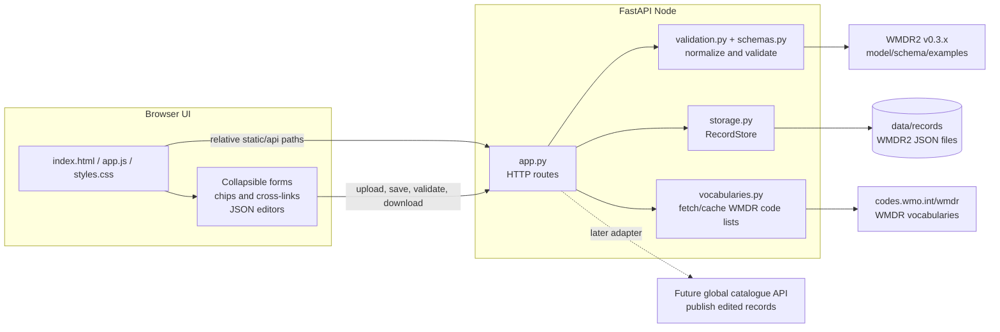

# WIGOS Node PoC v0.3.0 — Architecture overview

**Purpose.** The WIGOS Node PoC is a lightweight browser application for creating, uploading, reviewing, editing, validating, saving, reopening, and downloading WMDR2 v0.3.x full-record JSON documents. The PoC is intended to test the WMDR2 model and schema with real and synthetic use cases, not to act as a production OSCAR service.

## Architecture diagram

## Technology stack

The application uses a deliberately small stack. The backend is a Python FastAPI application served with Uvicorn. FastAPI exposes static files, record-management endpoints, validation endpoints, save/download endpoints, and vocabulary endpoints. The frontend is plain HTML, CSS, and vanilla JavaScript, without a frontend build step. This keeps the PoC easy to run locally, easy to deploy on a simple Python hosting service such as Render.com, and easy to inspect when field-level behaviour needs to be adjusted.

Persistent state is file-based. Records are stored as JSON files under the Node data directory, controlled by `OSCAR_NODE_DATA_DIR` when needed. This is sufficient for local testing and hosted PoC sessions, and avoids adding a database before the data-management semantics are clear. The app can later be extended with a database, object storage, or direct catalogue publication without changing the basic editing workflow.

## Functional components

| Component | Main files | Responsibility |
|---|---|---|
| Browser shell | `node/static/index.html`, `node/static/styles.css` | Page structure, collapsible sections, dialogs, visual states, README link. |
| Browser logic | `node/static/app.js` | Client-side state, form rendering, chip controls, cross-link navigation, field highlighting, API calls. |
| HTTP API | `node/app.py` | FastAPI app, route definitions, static serving, upload/paste/create/save/validate/download orchestration. |
| Record storage | `node/storage.py` | File-backed record persistence, safe filenames, reload/export support, save-as handling. |
| Validation | `node/validation.py`, `node/schemas.py` | Import normalization, cleanup of empty optional shells, PoC schema validation, error reporting. |
| Vocabularies | `node/vocabularies.py` | Fetches and caches selected WMDR code lists, with preservation of existing values when a live list is unavailable. |
| Tests | `tests/` | Regression checks for API behaviour, validation, normalization, and frontend syntax. |

## Main workflow

A user starts by creating a new facility, uploading a WMDR2 JSON file, pasting a record, or reopening a saved record. The browser sends the record to the backend, which normalizes it and stores it through `RecordStore`. The UI then renders the facility, ObservationSeries, observing configurations, instruments, reusable contacts, procedures, schedules, and JSON editors from the in-memory record state.

Most edits happen in structured form controls. Single-value vocabulary fields use dropdowns. Multi-value fields use compact chip lists with a `+` selector. Cross-links connect related model entities, for example from an ObservationSeries to observing procedures, reporting procedures, instruments, contacts, and schedules. When a user follows a link, the page collapses unrelated top-level sections, opens the target section, scrolls to the relevant card or row, and highlights it.

When the user validates, the browser first synchronizes all visible controls back into the JSON record and sends it to the backend. The backend applies normalization and schema checks, then returns a validation report. The frontend turns relevant validation errors into clickable entries and highlights the affected fields where it can map the JSON path to a form control. Saving uses the same synchronized record state and writes a JSON file to the configured data directory. Downloading returns the current JSON record as a WMDR2 file.

## WMDR2 coverage in v0.3.0

The current form covers the core entities needed for early WMDR2 testing: Facility, geolocation and territory history, selected environment metadata, ObservationSeries, observing configurations, instruments, reusable contacts, observing procedures, reporting procedures, and reusable schedules. Facility metadata includes geolocation, territory, description, additional metadata, surface cover with classification scheme, Davenport roughness, population/perimeter pairs, and topography/bathymetry fields backed by WMDR code lists where available.

The procedures and schedules section is intentionally minimal. Observing and reporting procedure cards are linked from their parent ObservationSeries, and schedule reference chips can navigate to the corresponding reusable schedule row. The reverse direction is handled with “Used by” chips because a schedule may be reused by multiple procedures. Reusable schedule editing remains bare-bones and should be redesigned later with a more user-friendly schedule-specific widget.

## Deployment and limitations

The app runs locally with `python -m uvicorn node.app:app --reload`. Hosted deployment can use the same FastAPI process, usually with `--host 0.0.0.0` and a platform-provided port. The frontend uses relative asset and API paths so that it can work behind a reverse proxy or hosted base URL.

This remains a PoC. It has no built-in authentication or authorization, does not yet implement complete field coverage, and should not be treated as the authoritative WMDR2 validator. Validation is sufficient to support iterative model/schema testing and to generate sample JSON for known and additional use cases. Publication of new or edited records to the global catalogue is not part of the current PoC, but can be added as a backend adapter once an API becomes available.
